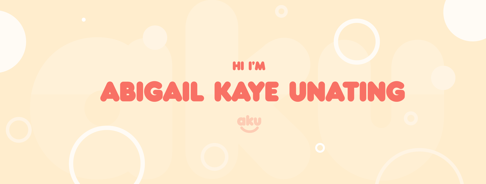

<h2>Hi! Nice to meet you 
</h2>

 

- <i>Currently:</i> Information Technology student at West Visayas State University

<h2>💻 I'm Currently Learning</h2>

__Full Stack Web Development__

<h2>Stats</h2>

  
  

  <b><em>Overall GitHub Stats:</em></b>  
       
  <b>

<h2> Public Social Media⚡:</h2>

Check me out here!
 
- Behance: [https://www.behance.net/abbyunat](https://www.behance.net/abbyunat)
- Linkedin: [https://www.linkedin.com/in/abbyunat/](https://www.linkedin.com/in/abbyunat/)
- Twitter: [https://twitter.com/akusikei](https://twitter.com/akusikei)

<h2>📫 How to reach me:</h2>

 
